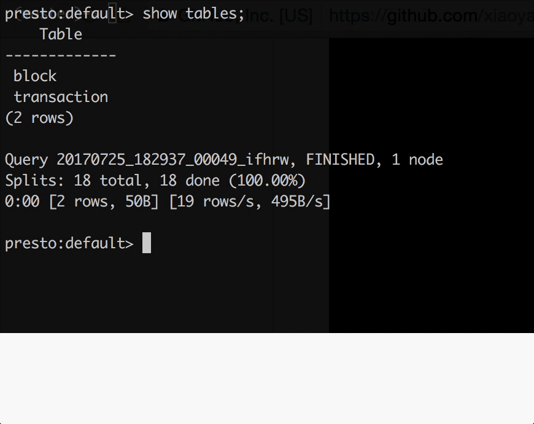
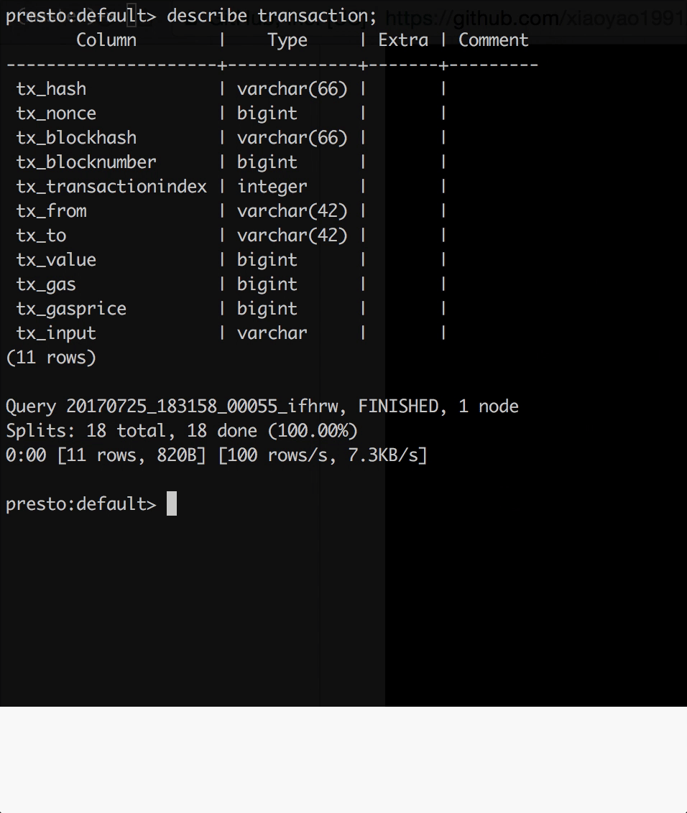
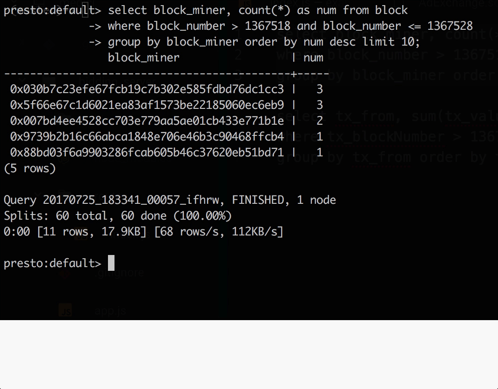

# Presto Ethereum Connector
Unleash the Power of Presto Interactive SQL Querying on Ethereum Blockchain

### Introduction
[Presto](https://prestodb.io) is a powerful interactive querying engine that enables running SQL queries on anything -- be it MySQL, HDFS, local file, Kafka -- as long as there exist a connector to the source.

This is a Presto connector to the Ethereum blockchain data. With this connector, one can get hands on with Ethereum blockchain analytics work without having to know how to play with the nitty gritty Javascript API.

### Prerequisites
Have an Ethereum client that you can connect to. There are 2 options:
1. Run [Geth](https://github.com/ethereum/go-ethereum) or [Parity](https://github.com/paritytech/parity) locally.
1. Use [Infura](https://infura.io), a hosted Ethereum client in the cloud.    

### Usage
1. [Install Presto](https://prestodb.io/docs/current/installation/deployment.html). *Follow the instructions on that page to create relevant config files.*  
  By the end of this step, your presto installation folder structure should look like:
    ```
    ├── bin
    ├── lib
    ├── etc
    │   ├── config.properties
    │   ├── jvm.config
    │   └── node.properties
    ├── plugin
    ```
1. [Install Presto CLI](https://prestodb.io/docs/current/installation/cli.html)
1. Clone this repo and run `mvn clean package` to build the plugin. You will find the built plugin in the `target` folder.
1. Load the plugin to Presto  
    a. Create the ethereum connector config inside of `etc`.  
    `$ mkdir -p etc/catalog && touch etc/catalog/ethereum.properties`   
    Paste the following to the ethereum.properties:
    ```
    connector.name=ethereum

    # You can connect through Ethereum HTTP JSON RPC endpoint
    ethereum.jsonrpc=http://localhost:8545/

    # Or you can connect through IPC socket
    # ethereum.ipc=/path/to/ipc_socketfile

    # Or you can connect to Infura
    # ethereum.infura=https://mainnet.infura.io/<your_token>
    ```
    b. Copy and extract the built plugin to your presto plugin folder  
    ```
    $ mkdir -p plugin/ethereum \
      && cp <path_to_this_repo>/target/presto-ethereum-*-plugin.tar.gz . \
      && tar xfz presto-ethereum-*-plugin.tar.gz -C plugin/ethereum --strip-components=1
    ```  

    By the end of this step, your presto installation folder structure should look like:  
      ```
      ├── bin
      ├── lib
      ├── etc
      │   ├── catalog
      │   │   └── ethereum.properties
      │   ├── config.properties
      │   ├── jvm.config
      │   └── node.properties
      ├── plugin
      │   ├── ethereum
      │   │   └── <some jars>
      ```
1. There you go. You can now start the presto server, and query through presto-cli:  
  ```
  $ bin/launcher start
  $ presto-cli --server localhost:8080 --catalog ethereum --schema default
  ```

### Demo
Showing all the tables available


Schema of the `block` table


Schema of the `transaction` table


Get the top miners based on blocks mined within a block range


Get the top accounts based on values going out within a block range

