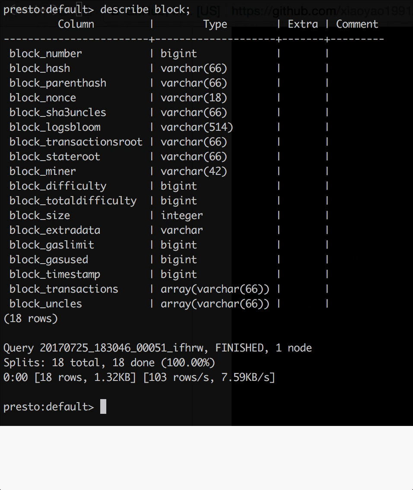
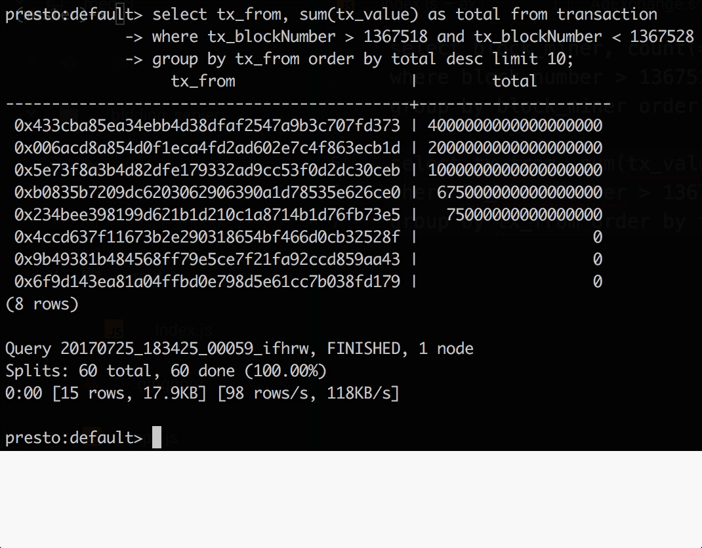

# Presto Ethereum Connector
Unleash the Power of Presto Interactive SQL Querying on Ethereum Blockchain

### Introduction
[Presto](https://prestodb.io) is a powerful interactive querying engine that enables running SQL queries on anything -- be it MySQL, HDFS, local file, Kafka -- as long as there exist a connector to the source.

This is a Presto connector to the Ethereum blockchain data. With this connector, one can get hands on with Ethereum blockchain analytics work without having to know how to play with the nitty gritty Javascript API.

### Demo
Showing all the tables available

Schema of the `block` table

Schema of the `transaction` table

Get the top miners based on blocks mined within a block range

Get the top accounts based on values going out within a block range

### Usage
1. Have an Ethereum client([Geth](https://github.com/ethereum/go-ethereum), [Parity](https://github.com/paritytech/parity)) running locally. *TODO: Infura support coming soon*
2. [Install Presto](https://prestodb.io/docs/current/installation/deployment.html)
3. Clone this repo and run `mvn clean install` to build the plugin jar
4. Load the plugin to Presto
